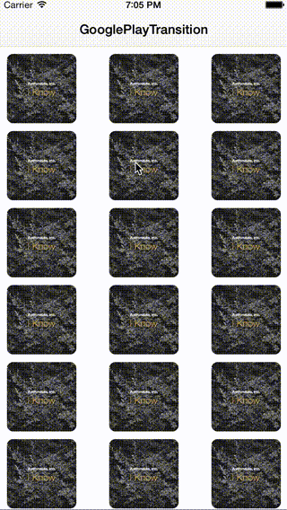

# ARNTransitionAnimator

Custom transition & interactive transition animator for iOS. written in Swift.

## Requirements

* Xcode 7.0
* iOS 8.1+
* Swift 2.0

## Use Example

### [SoundCloudTransition](https://github.com/xxxAIRINxxx/SoundCloudTransition)

### [ARNZoomImageTransition](https://github.com/xxxAIRINxxx/ARNZoomImageTransition)

### [ARNModalTransition](https://github.com/xxxAIRINxxx/ARNModalTransition)

### [GooglePlayTransition](https://github.com/xxxAIRINxxx/GooglePlayTransition)

### [ARNInteractiveTransition](https://github.com/xxxAIRINxxx/ARNInteractiveTransition)

### [MusicPlayerTransition](https://github.com/xxxAIRINxxx/MusicPlayerTransition)

## License

MIT license. See the LICENSE file for more info.
